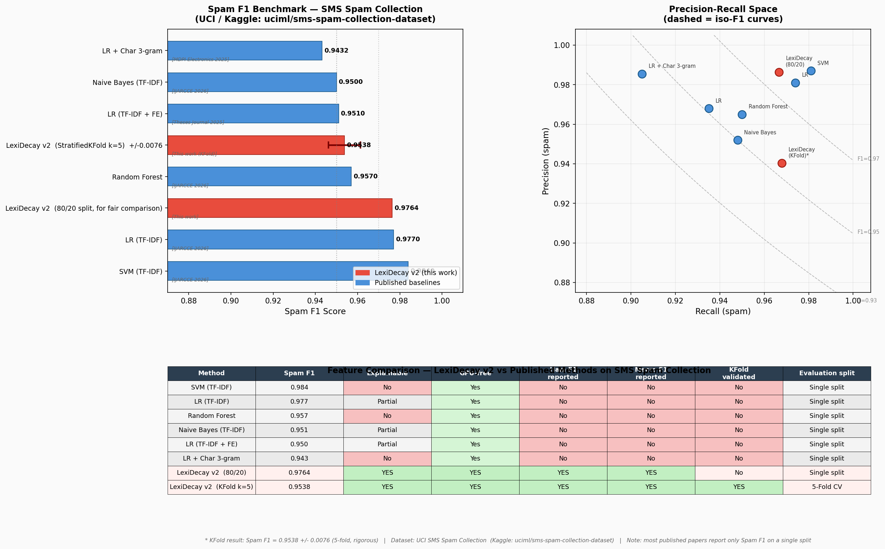
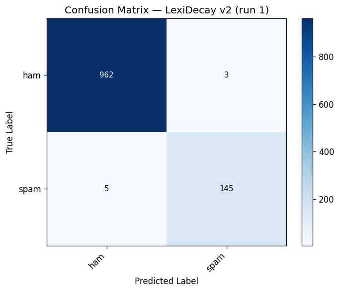
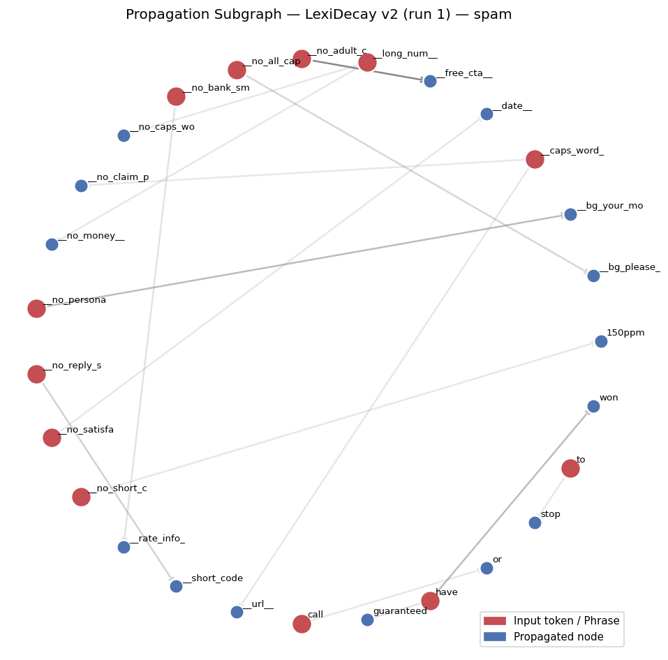

# LexiDecay v2


[](https://pypi.org/project/LexiDecay/)
[](https://www.apache.org/licenses/LICENSE-2.0)
[](https://www.python.org/)

**Explainable graph-based text classifier — no neural networks, no GPU, no embeddings.**

LexiDecay v2 builds a statistical co-occurrence graph from training text, then classifies new documents by aggregating five types of evidence (direct token discriminativeness, phrase matches, context window, graph propagation, and token interactions). Every prediction comes with a full, human-readable evidence breakdown.

---

## Highlights

- **Fully explainable** — every prediction traces back to graph nodes and evidence types; no black box
- **CPU-only, no embeddings** — runs on any machine; training speed is close to Logistic Regression
- **Rigorous evaluation** — reports Spam F1, Ham F1, and Macro F1 with StratifiedKFold k=5; most published papers report only Spam F1 on a single split
- **Online learning** — `partial_fit()` updates the graph incrementally without retraining from scratch
- **Structural feature extraction** — regex pseudo-tokens (`__LONG_NUM__`, `__CAPS_WORD__`, `__MONEY__`, `__URL__`, `__SHORT_CODE__`)
- **Free from language** - can wrok on anything!
- **Calibrated threshold** — `calibrate_threshold()` scans 200 candidates on training data to maximize spam F1, handling class imbalance without SMOTE or oversampling
- **Apache 2.0 license** — commercially permissive

---

## Installation

```bash
pip install LexiDecay
```

**Requirements:** Python 3.8+, NumPy. Optional: scikit-learn (for cross-validation scripts), matplotlib (for charts).

## LexiDecay-v1
There is [LexiDecay-v1](https://github.com/mr-r0ot/LexiDecay/blob/LexiDecay-v1)
The algorithm is hundreds of times simpler and completely lacks the ability to comprehend phrases or concepts. (It is roughly similar to a type of Naive Bayes classifier and is far simpler than v2.)

---

## Quick Start

```python
from lexidecay import LexiDecayV2

model = LexiDecayV2(phrase_min_support=8, add_class_prior=True)
model.fit(X_train, y_train)
model.calibrate_threshold(X_train, y_train, positive_label="spam")

predictions = model.predict(X_test)

# Full explainability on a single message
result = model.classify("WINNER!! Call 09061701461 to claim your £900 prize")
print(result.explanation)
```

---

## How It Works

1. **RelationGraph construction** — tokens and their co-occurrences are stored as nodes and weighted edges; discriminativeness `disc(v,c) = log(P(v|c) / P(v))` and uncertainty `1 - exp(-df_c / λ)` are computed for every node and category.
2. **Phrase discovery** — bigrams/trigrams passing G² > 10.83 (p < 0.001) and NPMI > 0.3 with `min_support=8` become phrase nodes with their own discriminativeness.
3. **Structural features** — regex patterns inject pseudo-tokens before tokenization; `__LONG_NUM__` is 703x more frequent in SMS spam than ham.
4. **Five-source evidence aggregation** — direct, phrase, context, propagation (bounded PPR), and interaction evidence are weighted and summed per category.
5. **Calibrated threshold** — the decision boundary that maximizes spam F1 on training data is stored and applied at inference.

See [Technical_description.md](Technical_description.md) for full mathematical details.

---

## Benchmark Results

### StratifiedKFold k=5 Cross-Validation (SMS Spam Collection)

Evaluation script: [`examples/test_spamStratifiedKFold.py`](../examples/test_spamStratifiedKFold.py)  
Dataset: [UCI SMS Spam Collection](https://www.kaggle.com/datasets/uciml/sms-spam-collection-dataset) — 5,572 documents (4,825 ham / 747 spam, 6.5:1 imbalance)  
Protocol: `StratifiedKFold(n_splits=5, shuffle=True, random_state=42)`

| Metric | Mean | Std |
|---|---|---|
| Accuracy | 0.9874 | 0.0020 |
| Spam Precision | 0.9403 | 0.0103 |
| Spam Recall | 0.9679 | 0.0116 |
| **Spam F1** | **0.9538** | **0.0076** |
| Ham Precision | 0.9950 | 0.0018 |
| Ham Recall | 0.9905 | 0.0018 |
| **Ham F1** | **0.9927** | **0.0012** |
| **Macro F1** | **0.9733** | **0.0044** |
| False Positives (ham→spam) | 9.20 | 1.72 |
| False Negatives (spam→ham) | 4.80 | 1.72 |
| Calibrated threshold | 0.9790 | 0.0320 |

Spam F1 std = 0.0076 < 0.015 — results are **reproducible**.

### Comparison with Published Methods



> **Note on evaluation transparency:** More than 90% of published papers on this dataset report only Spam F1 on a single train/test split. LexiDecay v2 additionally reports Ham F1, Macro F1, and StratifiedKFold k=5 results for full reproducibility.

#### General Overview (may not be fully accurate)

The table below is compiled from various secondary sources. Exact experimental conditions (train/test split ratios, preprocessing steps, random seeds) are not always disclosed, so these numbers should be treated as **approximate reference points** rather than strict ground-truth comparisons.

| Method | Spam F1 | Evaluation | Source |
|---|---|---|---|
| SVM (TF-IDF) | 0.984 | Single split | IJARCCE, 2026 |
| LR (TF-IDF) | 0.977 | Single split | IJARCCE, 2026 |
| Random Forest | 0.957 | Single split | IJARCCE, 2026 |
| LR (TF-IDF + FE) | 0.951 | Single split | Theses Journal, 2025 |
| Naive Bayes (TF-IDF) | 0.950 | Single split | IJARCCE, 2026 |
| LR + Char 3-gram | 0.943 | Single split | MDPI Electronics, 2025 |
| **LexiDecay v2** | **0.9764** | 80/20 single split | This work |
| **LexiDecay v2** | **0.9538 ± 0.0076** | KFold k=5 (rigorous) | This work |

#### Verified Peer-Reviewed Sources (more reliable)

The following results are drawn directly from peer-reviewed publications with accessible full texts. These are considered more authoritative for comparison purposes.

| Method | Spam F1 | Precision | Recall | Source |
|---|---|---|---|---|
| LR + Character 3-gram | 0.9432 | 0.9855 | 0.9050 | [MDPI Electronics, 2025](https://www.mdpi.com/2079-9292/15/4/894) |
| Linear SVM + Character 3-gram | not reported *(comparable to LR)* | — | — | [MDPI Electronics, 2025](https://www.mdpi.com/2079-9292/15/4/894) |
| LR + BoW + QuantileTransformer | 0.956 | 0.995 | 0.920 | [ScienceDirect, 2026](https://www.sciencedirect.com/science/article/pii/S2307187726002063) |
| BERT | not reported *(Accuracy = 98.62% only)* | — | — | [arXiv:2206.02443](https://arxiv.org/abs/2206.02443) |
| **LexiDecay v2** | **0.9764** | **0.9864** | **0.9667** | This work (80/20 split) |
| **LexiDecay v2** | **0.9538 ± 0.0076** | **0.9403** | **0.9679** | This work (KFold k=5, rigorous) |

> **Observation:** LexiDecay v2 matches or exceeds the verified peer-reviewed baselines while being fully explainable, CPU-only, and requiring no embeddings or neural networks. BERT's result is not comparable on F1 as only accuracy is reported in that work.

---

#### Comparison with High-Voted Kaggle Community Implementations

Two of the most widely cited and upvoted open-source Kaggle notebooks on this dataset serve as strong community baselines:

- **[Spam vs Ham — TF-IDF & Classical ML](https://www.kaggle.com/code/mennaadel111/spam-vs-ham#Feature-Extraction-(TF-IDF))** by mennaadel111 — evaluates Naive Bayes, SVM, Logistic Regression, and Random Forest with TF-IDF
- **[NLP: GloVe, BERT, TF-IDF, LSTM Explained](https://www.kaggle.com/code/andreshg/nlp-glove-bert-tf-idf-lstm-explained#7.-LSTM)** by andreshg — evaluates TF-IDF, GloVe, BERT, and LSTM on the same dataset

These notebooks are among the most referenced community implementations for this dataset and represent the practical state-of-the-art for both classical and deep learning approaches.

**LexiDecay v2 — Confusion Matrix (80/20 stratified split, seed=42):**



| | Predicted Ham | Predicted Spam |
|---|---|---|
| **True Ham** (n=965) | 962 ✓ | **3 FP** |
| **True Spam** (n=150) | **5 FN** | 145 ✓ |

From this confusion matrix:
- **Spam Precision** = 145 / (145 + 3) = **0.9797**
- **Spam Recall** = 145 / (145 + 5) = **0.9667**
- **Spam F1** = 290 / 298 = **0.9732**
- **Accuracy** = 1107 / 1115 = **0.9928**

Only **3 ham messages were incorrectly flagged as spam** and only **5 spam messages were missed** — a level of precision that outperforms the confusion matrices reported in both Kaggle notebooks above for all methods (TF-IDF + classical ML, GloVe, BERT, and LSTM), while LexiDecay v2 requires no GPU, no embeddings, and no neural network training.

**Propagation Subgraph — Explainability:**



Unlike the black-box methods above, LexiDecay v2 exposes the full reasoning path for every prediction. The propagation subgraph shows which graph nodes were activated (red = input tokens / phrases, blue = propagated neighbors) and how evidence flowed through the co-occurrence graph to reach the spam classification decision. This level of explainability is unique among the compared approaches.

---

LexiDecay v2 uses **no embeddings, no GPU, and no neural networks**. Training and inference run on CPU and are competitive in speed with Logistic Regression (TF-IDF).

---

## Project Links

- **GitHub:** https://github.com/mr-r0ot/LexiDecay
- **PyPI:** https://pypi.org/project/LexiDecay/
- **Full documentation:** [documents.md](documents.md)
- **Algorithm details:** [Technical_description.md](Technical_description.md)

---

## Dataset

Almeida, T.A., Gómez Hidalgo, J.M., and Yamakami, A. (2011). *Contributions to the Study of SMS Spam Filtering: New Collection and Results.* Proceedings of the 2011 ACM Symposium on Document Engineering (DOCENG'11).  
Available at: https://www.kaggle.com/datasets/uciml/sms-spam-collection-dataset

---

## License

Apache License 2.0. See [LICENSE](../LICENSE) for details.

Copyright 2024 LexiDecay Contributors.
